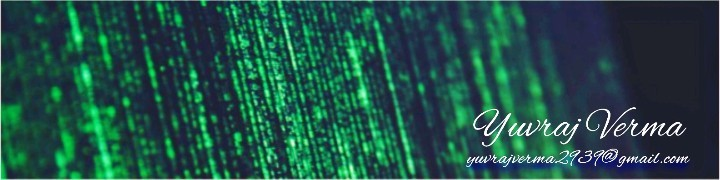

<h1 align="center">Yuvraj Verma</h1>

  AI/ML researcher and builder focused on NLP, OCR, computer vision, and educational AI.

  <a href="https://www.yuvrajverma.me/">Portfolio</a> |
  <a href="https://github.com/vermayuvraj">GitHub</a> |
  <a href="https://www.linkedin.com/in/verma-yuvraj">LinkedIn</a> |
  <a href="https://orcid.org/0009-0004-2138-3159">ORCID</a> |
  <a href="mailto:work.yuvrajverma@gmail.com">Email</a>

<table>
  <tr>
    <td width="62%" valign="top">
      <h3>About me</h3>
      <ul>
        <li>B.Tech in Electronics Engineering at Rajkiya Engineering College, Kannauj</li>
        <li>Foundation level in Data Science and Applications at IIT Madras</li>
        <li>Building AI systems that move from research ideas to practical products</li>
        <li>Interested in efficient sequence modeling, OCR pipelines, semantic evaluation, and real-world ML systems</li>
        <li>Based in Ayodhya, Uttar Pradesh, India</li>
      </ul>

      <h3>Current focus</h3>
      <ul>
        <li>Building a multimodal subjective answer sheet grading platform with Streamlit, Next.js, and FastAPI</li>
        <li>Running OCR experiments for historical print recognition and evaluation workflows</li>
        <li>Exploring hybrid RNN-Transformer architectures for efficient language modeling under compute constraints</li>
        <li>Looking for research collaborations, AI/ML roles, and product-building opportunities</li>
      </ul>

    </td>
    <td width="38%" valign="top" align="center">
      
    </td>
  </tr>
</table>

### Featured projects

| Project | What it does | Stack |
| --- | --- | --- |
| [auto-subjective-grader](https://github.com/vermayuvraj/auto-subjective-grader) | Multimodal subjective answer sheet grading platform for education workflows | Python, FastAPI, Next.js, Streamlit |
| [humanai-ocr2-gsoc-2026](https://github.com/vermayuvraj/humanai-ocr2-gsoc-2026) | Historical print OCR baseline, experiments, and full print-set outputs | Python, OCR, evaluation pipelines |
| [yuvrajverma-portfolio](https://github.com/vermayuvraj/yuvrajverma-portfolio) | Personal website for research, projects, updates, and professional profile | HTML, CSS, JavaScript |

### Experience snapshot

- Machine Learning and Full Stack Intern at Reaching Sky Foundation
- Machine Learning Intern at BreakOut AI
- Machine Learning Intern at Codesoft Technologies Pvt. Ltd.
- Google Student Ambassador and Training & Placement Coordinator

### Highlights

- India AI Impact Buildathon 2026: Top 2% national finalist
- Research interests across NLP, computer vision, educational AI, and efficiency engineering
- Certified through programs from DeepLearning.AI, Google Cloud, Neo4j, and Postman

### Tech I use

  
  
  
  
  
  
  
  
  
  

### GitHub stats

  
  

### Connect with me

- Portfolio: [yuvrajverma.me](https://www.yuvrajverma.me/)
- LinkedIn: [verma-yuvraj](https://www.linkedin.com/in/verma-yuvraj)
- ORCID: [0009-0004-2138-3159](https://orcid.org/0009-0004-2138-3159)
- YouTube: [@yuvrajverma_uv](https://www.youtube.com/@yuvrajverma_uv)
- Email: [work.yuvrajverma@gmail.com](mailto:work.yuvrajverma@gmail.com)
